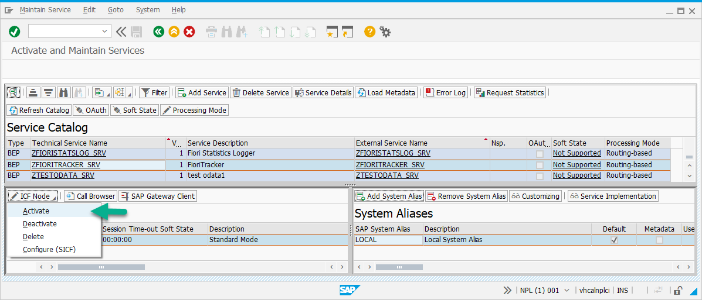

# Step 3 - Enable oData service

To enable oData service complete the sub-steps described below. 

| | |
|-|-|
When description refers to `Service name`, you need to put the service’s name of the run application. If you don't know the `Service name` please refer to the technical section of each product.

### 1. Generate Runtime objects in transaction SEGW

1.1. Start SAP Gui transaction **SEGW** 
1.2. Using the menu *Project > Open* - Open project named as the first part of the `Service name`. Fe. if `Service name` is ZFIORITRACKER_SVR please open project called ZFIORITRACKER.

1.3. Go to Change mode and choose function **Generate** (you will be prompted for transport and your user must be registered as developer)

### 2. Add the Service to Service Catalog

2.1 Start SAP Gui transaction **/n/IWFND/MAINT_SERVICE**

2.2 Find entry with `Service name`

If the entry is present then move to sub-step 3 (Add system alias to ICF node), in not, please execute the following steps:

2.3 Click on the **Add service** button.

2.4 Provide System Alias: LOCAL and External Service Name as the `Service name`.

2.5 Select the record with `Service name` and click on the Add selected services button.

### 3. Add system alias to ICF node

3.1 In /n/IWFND/MAINT_SERVICE, chose `Service name`

3.2 If ICF node is green and alias is present then the procedure is completed, if not, please execute the following steps:

3.3 Choose **Add system alias**, **New entry** and type `Service name`_0001 (f.e. ZFIORITRACKER_SRV_0001) in *Service Doc. Identifier* and "LOCAL" in *SAP System Alias* mark ***Default System** check-mark.

3.4 Click on **ICF node** button and from drop down chose **Activate**

 